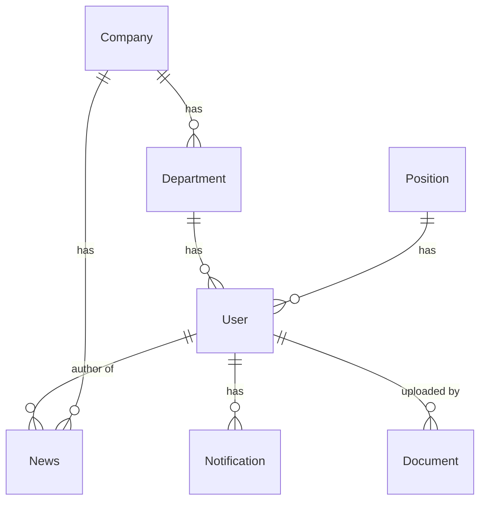

# Database Structure Documentation

## Models Overview

### User
| Field | Type | Description | Constraints |
|-------|------|-------------|-------------|
| id | UUID | Primary key | Primary Key, Default: uuidv4() |
| first_name | STRING | User's first name | - |
| corporate_login | STRING | Corporate login | Not Null, Unique |
| last_name | STRING | User's last name | - |
| middle_name | STRING | User's middle name | - |
| email | STRING | User's email | - |
| password | STRING | User's password | - |
| phone_number | STRING | User's phone number | - |
| birthday | DATE | User's birthday | - |
| role | ENUM | User's role | Values: 'admin', 'user', Default: 'user' |
| position_id | UUID | Foreign key to Position | References positions.id |
| department_id | UUID | Foreign key to Department | References departments.id |
| refresh_token | STRING | Refresh token for auth | - |
| created_at | TIMESTAMP | Creation timestamp | Auto-generated |
| updated_at | TIMESTAMP | Update timestamp | Auto-generated |

**Relationships:**
- Belongs to Department
- Belongs to Position
- Has many News (as author)
- Has many Notifications
- Has many Documents (as uploader)

### Company
| Field | Type | Description | Constraints |
|-------|------|-------------|-------------|
| id | UUID | Primary key | Primary Key, Default: uuidv4() |
| name | STRING | Company name | - |
| description | TEXT | Company description | - |
| address | STRING | Company address | - |

**Relationships:**
- Has many Departments
- Has many News
- Has many Users (through Departments)

### Department
| Field | Type | Description | Constraints |
|-------|------|-------------|-------------|
| id | UUID | Primary key | Primary Key, Default: uuidv4() |
| name | STRING | Department name | - |
| description | TEXT | Department description | - |
| company_id | UUID | Foreign key to Company | References companies.id |

**Relationships:**
- Belongs to Company
- Has many Users

### Position
| Field | Type | Description | Constraints |
|-------|------|-------------|-------------|
| id | UUID | Primary key | Primary Key, Default: uuidv4() |
| name | STRING | Position name | - |
| description | TEXT | Position description | - |

**Relationships:**
- Has many Users

### News
| Field | Type | Description | Constraints |
|-------|------|-------------|-------------|
| id | UUID | Primary key | Primary Key, Default: uuidv4() |
| title | STRING | News title | - |
| content | TEXT | News content | - |
| author_id | UUID | Foreign key to User | References users.id |
| company_id | UUID | Foreign key to Company | References companies.id |
| created_at | TIMESTAMP | Creation timestamp | Auto-generated |
| updated_at | TIMESTAMP | Update timestamp | Auto-generated |

**Relationships:**
- Belongs to User (as author)
- Belongs to Company

### Notification
| Field | Type | Description | Constraints |
|-------|------|-------------|-------------|
| id | UUID | Primary key | Primary Key, Default: uuidv4() |
| title | STRING | Notification title | - |
| message | TEXT | Notification message | - |
| read | BOOLEAN | Read status | Default: false |
| user_id | UUID | Foreign key to User | References users.id |
| created_at | TIMESTAMP | Creation timestamp | Auto-generated |
| updated_at | TIMESTAMP | Update timestamp | Auto-generated |

**Relationships:**
- Belongs to User

### Document
| Field | Type | Description | Constraints |
|-------|------|-------------|-------------|
| id | UUID | Primary key | Primary Key, Default: uuidv4() |
| title | STRING | Document title | - |
| description | TEXT | Document description | - |
| fileUrl | STRING | Document file URL | - |
| category | STRING | Document category | - |
| status | ENUM | Document status | Values: 'draft', 'pending', 'approved', 'rejected', Default: 'draft' |
| uploader_id | UUID | Foreign key to User | References users.id |
| created_at | TIMESTAMP | Creation timestamp | Auto-generated |
| updated_at | TIMESTAMP | Update timestamp | Auto-generated |

**Relationships:**
- Belongs to User (as uploader)

## Database Schema Overview

## Key Features

1. **UUID Primary Keys**
   - All models use UUID as primary keys
   - Auto-generated using uuidv4()

2. **Timestamps**
   - Models with timestamps: User, News, Notification, Document
   - Tracks creation and update times

3. **Text Fields**
   - Used for long-form content (description, content, message)
   - Better for large text storage

4. **Enums**
   - User.role: 'admin', 'user'
   - Document.status: 'draft', 'pending', 'approved', 'rejected'

5. **Foreign Key Constraints**
   - All relationships properly defined with references
   - Ensures data integrity

6. **Hierarchical Structure**
   - Company → Department → User
   - Clear organizational hierarchy

## Best Practices Implemented

1. **Data Integrity**
   - Foreign key constraints
   - Not null constraints where needed
   - Unique constraints where appropriate

2. **Scalability**
   - UUID primary keys
   - Proper indexing through foreign keys
   - Text fields for large content

3. **Maintainability**
   - Clear naming conventions
   - Consistent structure across models
   - Proper relationship definitions

4. **Security**
   - Separate fields for sensitive data (password, refresh_token)
   - Role-based access control through role enum 